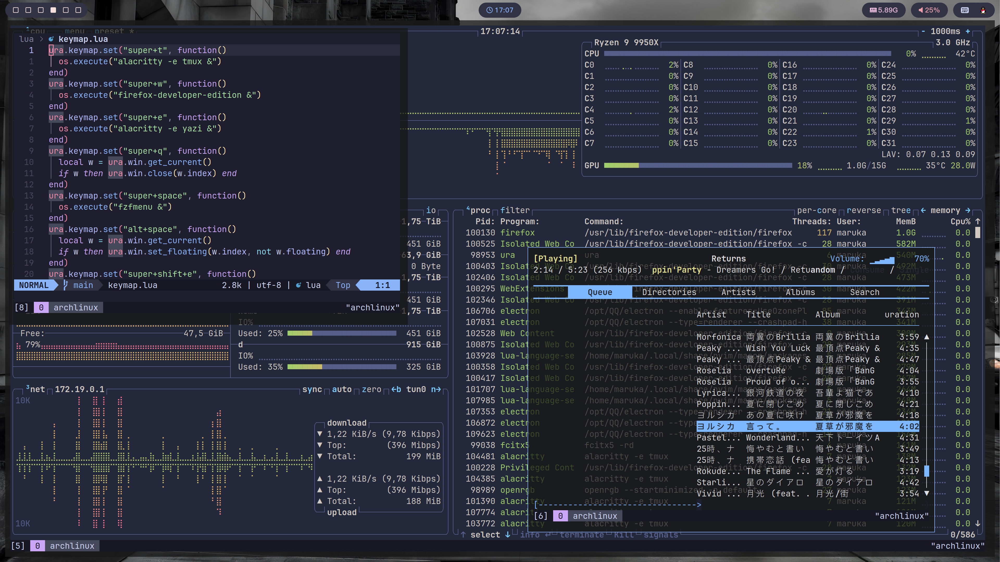

# Ura


**Ura** is a brand-new Wayland compositor built on **wlroots**, written in **C++**, and uses **Lua (LuaJIT)** as its configuration system.

The strength of Ura lies in its high customizability. Through a **hook mechanism**, it exposes part of the window manager’s functionality, allowing you to inject code into specific workflows.

Lua is a general-purpose language supported by many editors and LSPs (like `lua_ls`). This enables features such as error checking, syntax highlighting, and auto-completion for configuration files, allowing you to configure the compositor as if you're writing actual code.




## Installation

### Build

Dependencies include:

- wlroots0.20
- [luajit](http://luajit.org/)
- [libnotify](https://gitlab.gnome.org/GNOME/libnotify)
- [spdlog](https://github.com/gabime/spdlog)

Make dependencies include:

- wayland-protocols
- [sol2](https://aur.archlinux.org/packages/sol2) (auto-imported by CPM)
- cargo
- make
- cmake
- pkgconf
- [Glaze](https://github.com/stephenberry/glaze)
- cxxopts
- ninja (optional)
- sccache (optional)

```shell
git clone https://github.com/levinion/ura.git
cd ura
make
```

Run the C++ and tool tests with:

```shell
ctest --test-dir build --output-on-failure
```

### Docker

```shell
docker build -t levinion/ura .
docker run --rm -v .:/home/dev/ura levinion/ura make build
sudo make install
```

### AUR

```shell
paru/yay -S ura-git
```

## Configuration

Ura looks for its configuration in `$XDG_CONFIG_HOME/ura/init.lua` when `XDG_CONFIG_HOME` is set, or `$HOME/.config/ura/init.lua` otherwise. If that selected user path is missing, it falls back to `/etc/ura/init.lua`.

The [default configuration file](/assets/init.lua) is installed with Ura at `/etc/ura/init.lua`. If you wish to modify it, it's recommended to copy it to your user directory before making changes.

The default terminal is [foot](https://codeberg.org/dnkl/foot), which can be launched using the `super+t` shortcut. However, make sure that `foot` is installed before starting Ura, or change it to another terminal of your choice.

### Keybindings

Define keybindings using the following format: one or more modifier keys (or none) followed by a single key, connected by `"+"`:

```lua
ura.keymap.set({ "super+t" }, function()
  ura.api.spawn("foot")
end)

ura.keymap.set({ "super+q" }, function()
  ura.class.UraWindow:current():close()
end)

ura.keymap.set({ "alt+space" }, function()
  ura.class.UraWindow:current():toggle_layout("floating")
end)
```

### Hooks

Hooks are Ura’s most powerful feature. They allow arbitrary operations to be performed using public APIs during the compositor’s runtime, enabling features that other compositors typically can’t support. Hooks also offer a cleaner way to implement advanced features such as window rules.

Here are some examples:

The `prepare` hook runs after the Lua module is initialized, but before compositor resources are created. You can use this hook to set global environment variables:

```lua
ura.hook.add("prepare", function(_)
  ura.api.set_env("WLR_RENDERER", "vulkan")
  ura.api.set_env("WLR_NO_HARDWARE_CURSORS", "0")
  ura.api.set_env("LIBVA_DRIVER_NAME", "nvidia")
  ura.api.set_env("__GLX_VENDOR_LIBRARY_NAME", "nvidia")
end)
```

Use the `ready` hook to start applications after the compositor backend is running:

```lua
ura.hook.add("ready", function(_)
  ura.api.set_env("DISPLAY", ":0")
  ura.api.spawn("xwayland-satellite")
end)
```

The `window-new` hook runs when a new top-level window is prepared, before its first map. You can use it to apply window-specific styling:

```lua
ura.hook.add("window-new", function(e)
	local win = ura.class.UraWindow:new(e.id)
	local app_id = win:app_id()
	assert(app_id)
	if app_id == "fzfmenu" then
		win:set_layout("floating")
		win:resize(1000, 600)
		win:center()
	end
end)
```

For the complete Lua-side API, see the [Lua API reference](docs/lua-api.md), including the [hook names and event payloads](docs/lua-api/hooks.md).

More configuration examples are available at: [examples](https://github.com/levinion/dotfiles/tree/main/user/ura/.config/ura)

## Dev

```shell
docker build -t levinion/ura .
docker run --rm -it -v .:/home/dev/ura levinion/ura
```

## License

This project is licensed under the terms of the [GPLv3](/LICENSE).
